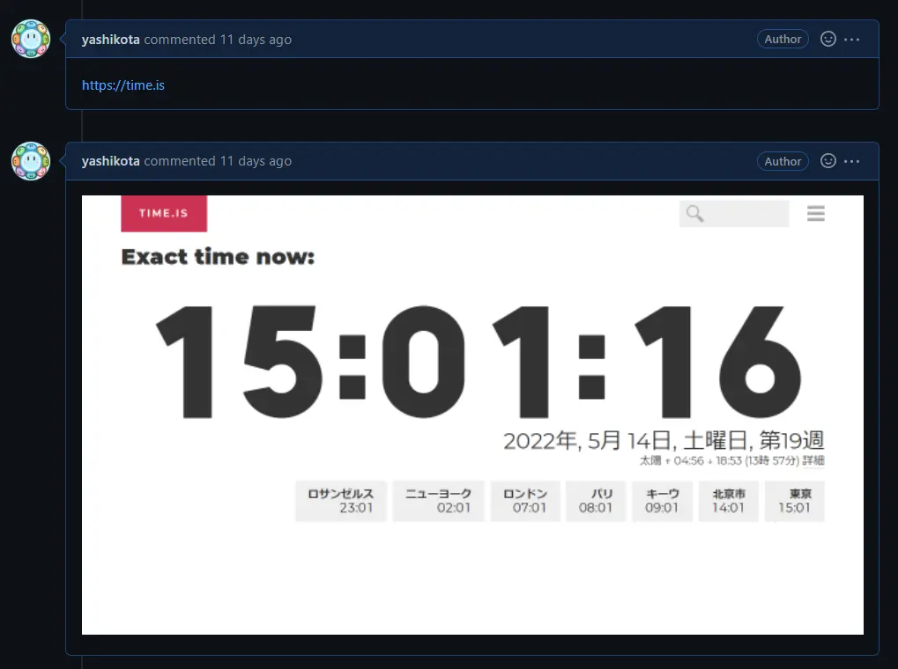

毎月末に活動日誌的なブログ書くことにしました。
後からどんなことをやってきたか振り返る時に役立つかなぁって感じです。
いつまで続くか分からないですが、よろしくお願いします(._.)

## やったこと

GW後半は暇だったのでBotでも作るかぁとなって以下の2つを作りました。  
[OIT Markov Bot](https://github.com/yashikota/oit-markov)
と
[Aozora Markov](https://github.com/yashikota/aozora-markov)  
OITの方はOIT生のツイートを利用しています。
Aozoraは
[青空文庫](https://www.aozora.gr.jp/)
さんの
[アクセスランキング(通年)](https://www.aozora.gr.jp/access_ranking/index.html)
の作品を利用しています。
それとリポジトリは非公開ですが、

こんな感じにプルリクのコメントに書かれたURLのスクショを貼っつけてくれるBotを作りました。
これだけだと使いどころがイマイチ分からないですが、次に作ろうとしているBotのテストの自動化に非常に役に立つ(であろう)感じです。
仕組み的にはGithub REST APIでプルリクのコメント取得し、playwrightでスクショ、Discordに画像をアップロードした後Github REST APIで画像を書き込むといった流れです。  
あとは個人的な
[スプラトゥーンDiscord鯖](https://discord.gg/qvmapV27K3)
用に
[Bot](https://github.com/yashikota/ikayaki-bot)
を作ったり、
[勉強会の資料](https://github.com/yashikota/meetup)
を書いたりしてました。

## 読んだ本

- 防災アプリ特務機関NERV : 最強の災害情報インフラをつくったホワイトハッカーの10年

災害時にいつもお世話になるNERVができた経緯や歴史がまとまった本。非常に面白かった。  
あと開発者の石森さんが小学生の時からLinuxサーバを立てて外部に貸出してた話とかも載っていてやっぱり凄い人は凄いな…(語彙力)となった。
こういう伝記ものは好きなのでもっと読んでいきたいところ。

- 機械学習&ディープラーニングのしくみと技術がこれ1冊でしっかりわかる教科書

五目並べAI作ってみたいなぁって思っているのでちゃんとAIのことを勉強するためにも読んだ。  

- データベースのしくみ

DBは完全に無知なので入門として読んだ。なんとなくDBとSQLが分かったので勝ち。  
〇〇のしくみシリーズはサクッと読めて個人的にはおすすめ。

- ホワイトハッカーの教科書

タイトルに引かれて読んだ。
ハッキングの技術書ってわけじゃないけど、心構えとか学習のロードマップとか示されていて良かった。
今後のライフプランに参考に出来ればいいな。

- Visual Studio Code実践入門!

VSCode信者だけどあまり便利機能知らんなぁってなったので。  

- 図解まるわかりAIのしくみ

こっちもAIの本。ちゃんと入門できた気がするので次はもう初学者向けの本を読みたい感じ。
なんかいい本あれば教えてください。

---

今月は軽めの本しか読んでなかったので、来月はハンズオン系の技術本を読むようにしたいです。
あと積読が溜まってきてるのでそれの消化も。

## 書いた記事

[OIT WordCloudを支える技術](https://yashikota.com/oit-wc.html)
と
[OIT Markov Botを支える技術](https://yashikota.com/oit-markov.html)
の2本です。  
書くのはだいぶ遅くなってしまいましたが、両方とも無事に公開できて良かったです。  
来月はもうちょい軽めの記事を書きたいなぁって感じです。

## 来月の目標

- 天気予報作画システムの開発
- Reactでクイズアプリ作る
- シラバスのDB構築
